# Adapters for SQLAlchemy

<br>
<br>

## Abstracts

Здесь дано краткое описание архитектуры взаимодействия RDBMS PostgreSQL с клиентом, в роли которого выступает адаптер.

<br>
<br>

## Table of Contents

- [Description](#description)
- [Psycopg2](<>)
  - [Session-cursors-transactions](#session-cursors-transactions)
  - [Cursor](#cursor)
    - [execute()](<#execute()>)
    - [executemany()](<#executemany()>)
    - [other](#other)
- [References](#References)
- [Annex A: Schema](#annex-a)
- [Annex B: psycopg3 vs asyncpg](#annex-b)
- [Annex C: session, cursors, transactions](#annex-c)

<br>
<br>

## Description

1. PostgreSQL взаимодействует с клиентом посредством сообщений сформированных в соответствии с клиентским протоколом (PostgreSQL Wire Protocol), который определяет:

   - Формат клиентских и серверных сообщений
   - Команды и типы ответов
   - Механизм установления, поддержания и закрытия соединений
   - Правила кодирования типов данных
   - Формат сообщений об ошибках и исключениях

1. libpq - это официальная C‑библиотека от разработчиков PostgreSQL, реализующая поддержку PostgreSQL Wire Protocol

   - Реализует Wire Protocol на низком уровне
   - Поддерживает SSL, пул соединений, аутентификацию
   - Является «движком» для многих клиентских драйверов (включая psycopg2)

1. DB API 2.0 (Python database API specification 2.0)

   - Python-спецификация (PEP249) которая определяет, каким должен быть интерфейс для работы с базой данных

1. psycopg2 - самый популярный адаптер для python

   - Представляет из себя обёртку над libpq
   - Полностью соотвествует DB API 2.0
   - поддерживает расширенные типы PostgreSQL (массивы, JSON, UUID)

1. Асинхронность в psycopg2

   - Хотя в документации для psycopg2 указано asynchronous communication, на практике она почти никогда не используется
   - Это происходит потому, что у psycopg2 нет удобного уровня абстракции для этого и асинхронными запросами приходится управлять вручную

1. Для асинхронного взаимодействия с PostgreSQL используется asyncpg (или psycopg3)

   - asyncpg не является реализацией DB API (PEP249) и не использует libpq
   - напрямую работает с Wire Protocol
   - оптимизирован для asyncio (неблокирующие операции, пул соединений)

<br>
<br>

## Psycopg2

### Session-cursors-transactions

Сессия, курсоры и транзакции

1. Сессия - это логический контекст, возникающий с момента начала подключения и до его завершения (явного или неявного)

1. В рамках одной сессии объект *connection* управляет состоянием транзакции - изменения можно зафиксировать(commit) или откатить(rollback)

1. В рамках одной сессии может быть создано множество курсоров, они будут сохранять свое состояние между транзакциями

1. Транзакция - это последовательность операций над базой данных, которая выполняется как единое целое

1. По умолчанию транзакция начинается с первого выполненного запроса и завершается выполнением commit или rollback

<br>
<br>

### Cursor

Курсор - это объект для выполнения запросов и извлечения данных.

Курсор предлагает несколько методов для выполнения SQL-запросов.\
Основными из них это *execute()* и *executemany()*.

<br>
<br>

#### execute()

```python
cursor.execute(query, vars=None)
```

*query* - строка с SQL-запросом (может содержать плейсхолдеры)  
*vars* - параметры для подстановки (кортеж, список, словарь)

Суть: Выполняет один SQL-запрос (один оператор) с возможностью подстановки параметров

Поддерживает универсальные (%) и именованные (%(name)s) плейсхолдеры

Пример 1: универсальные плейсхолдеры

```python
cur.execute("INSERT INTO users (name, age) VALUES (%s, %s)", ("Alice", 30))
```

Пример 2: именованные плейсхолдеры (при использовании словаря)

```python
cur.execute(
    "INSERT INTO users (name, age) VALUES (%(name)s, %(age)s)",
    {"name": "Bob", "age": 25}
)
```

Возврат результата:

*SELECT*
Сохраняет результирующий набор - доступ через fetchone(), fetchmany(), fetchall()

*INSERT/UPDATE/DELETE*
Всегда возвращает None\
Но можно получить число затронутых строк через cursor.rowcount

<br>
<br>

#### executemany()

```python
cursor.executemany(query, seq_of_vars)
```

*query* - SQL-запрос с плейсхолдерами\
*seq_of_vars* - последовательность параметров (список кортежей, список списков или генератор)

Суть: Эффективное выполнение одного и того же запроса для множества наборов параметров.\
Может быть быстрее, чем цикл с execute()

Поддерживает универсальные (%) и именованные (%(name)s) плейсхолдеры\
НО не поддерживает именованные плейсхолдеры для списка кортежей

Пример:

```python
data = [
    ("Alice", 30),
    ("Bob", 25),
    ("Charlie", 35)
]

cur.executemany("INSERT INTO users (name, age) VALUES (%s, %s)", data)
```

Возврат результата:

Всегда возвращает None  
Но можно получить число затронутых строк через cursor.rowcount

<br>
<br>

#### other

Для случаев с большим объемом данных строит рассмотреть cursor.copy_from() или execute_batch из psycopg2.extras

<br>
<br>

## References

[PostgreSQL Wire Protocol docs](https://www.postgresql.org/docs/current/protocol.html)\
[libpq docs](https://www.postgresql.org/docs/current/libpq.html)\
[DB API PEP249 spec](https://peps.python.org/pep-0249/)\
[psycopg2 docs](https://www.psycopg.org/docs/index.html)\
[psycopg3 docs](https://www.psycopg.org/psycopg3/)\
[asyncpg docs](https://magicstack.github.io/asyncpg/current/)

<br>
<br>

## Annex A


<br>
<br>

## Annex B

| Критерий | psycopg3 | asyncpg |
|-------------------------|----------------------------------------------------------------------------------------------------|-------------------------------------------------------------------------------------------------------------------|
| Интеграция с SQLAlchemy | Поддерживается через асинхронные возможности, но требует более сложной настройки | Оптимизирован для асинхронной работы с SQLAlchemy, часто используется в современных проектах |
| Производительность | Обычно уступает asyncpg в асинхронных сценариях | Считается более производительным благодаря нативной реализации асинхронных операций и оптимизации для PostgreSQL. |
| Совместимость с DB-API | Соответствует PEP 249 (DB-API) | Не реализует DB-API, имеет собственный API |
| Использование | Подходит для проектов, где важна совместимость с синхронным кодом или требуется гибкость настройки | Рекомендуется для высоконагруженных асинхронных приложений, где критична скорость |


<br>
<br>

## Annex C


